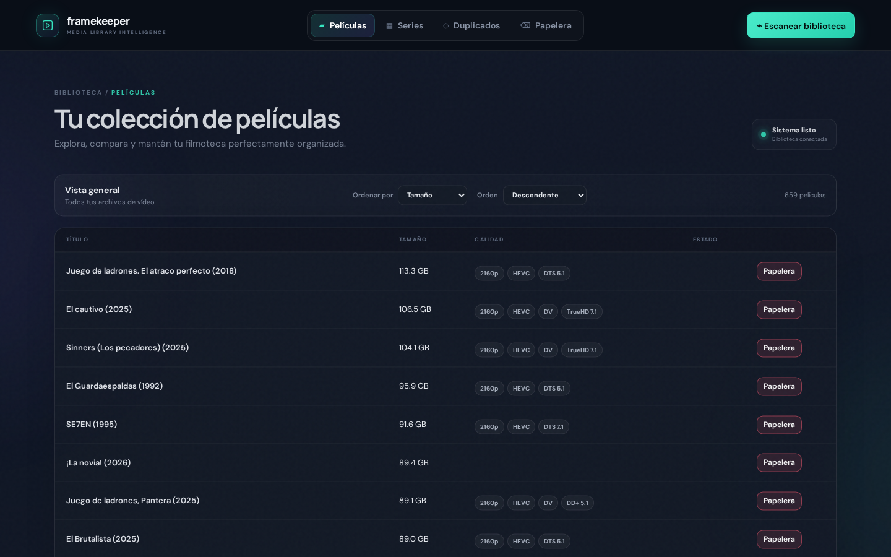

# Framekeeper

Framekeeper is a self-hosted web application for inspecting, organizing, and deduplicating a movie and TV library stored on a NAS. It scans video files, extracts technical metadata with `ffprobe`, groups likely duplicates, scores their quality, and helps you reclaim space without immediately deleting anything.

The interface is currently in Spanish, while this documentation is in English.



## What it does

- Browses movies and TV series from a single web interface.
- Groups series by show and season.
- Parses release names to identify titles, years, seasons, episodes, quality tags, languages, and release groups.
- Uses `ffprobe` to inspect resolution, codecs, HDR, bitrate, audio channels, languages, container, and duration.
- Detects likely duplicate movies and episodes.
- Assigns configurable quality scores and recommends which copy to keep.
- Runs library scans in the background with progress reporting and cancellation.
- Caches scan results and technical metadata in SQLite.
- Moves unwanted files into a recoverable trash directory on the NAS.
- Restores trashed files or permanently removes them after explicit confirmation.
- Checks the NAS mount and can retry mounting it through a narrowly scoped `sudoers` rule.

## How duplicate recommendations work

Framekeeper normalizes movie and series names, groups matching releases, and compares the files in each group. Its score combines:

- Resolution
- Source quality
- HDR format
- Audio codec and channel layout
- Bitrate relative to the other copies in the group

The weights are configured in `config.json`. When scores are effectively tied, file size is used as a tie-breaker. Recommendations are guidance only: Framekeeper does not automatically delete duplicate files.

## Safety model

Moving an item to trash relocates it to a `#trash-mdmgr` directory inside the corresponding movie or series library. It can then be restored from the UI. Emptying the trash permanently deletes the selected files and requires explicit confirmation.

Framekeeper changes real files on the NAS. Before using its trash features, make sure your library is backed up and the configured movie, series, and trash paths are correct.

Credentials are deliberately kept outside this repository. `config.json`, `.env` files, credential files, private keys, the local SQLite database, and local editor/agent settings are excluded by `.gitignore`.

## Requirements

- Linux
- Python 3.10 or newer
- Flask
- `ffmpeg` / `ffprobe`
- `mount.cifs` from `cifs-utils` when using the automatic NAS mount setup
- A CIFS/SMB-accessible NAS library

On Debian or Ubuntu, the system packages can be installed with:

```bash
sudo apt update
sudo apt install python3 python3-flask ffmpeg sqlite3 cifs-utils
```

Alternatively, install Flask in a virtual environment:

```bash
python3 -m venv .venv
source .venv/bin/activate
python3 -m pip install Flask
```

## Configuration

Copy the example configuration and edit the local copy:

```bash
cp config.example.json config.json
```

The configuration has four sections:

| Section | Purpose |
| --- | --- |
| `nas` | NAS address, SMB share, mount point, library folders, trash folder, credential file, and mount wrapper |
| `db_path` | Path of the local SQLite database |
| `server` | Address and port used by the Flask server |
| `scoring` | Weights used for duplicate quality recommendations |

Example NAS settings:

```json
{
  "nas": {
    "host": "nas.local",
    "share": "media",
    "mount_point": "/mnt/nas-media",
    "movies_dir": "MOVIES",
    "series_dir": "SERIES",
    "trash_dirname": "#trash-mdmgr",
    "credentials_file": "/home/YOUR_USER/.config/mdmgr/nas.cred",
    "mount_wrapper": "/usr/local/sbin/mdmgr-mount-nas.sh"
  }
}
```

`movies_dir` and `series_dir` are resolved relative to `mount_point`.

### NAS credentials

Create the credential file outside the repository:

```bash
mkdir -p ~/.config/mdmgr
chmod 700 ~/.config/mdmgr
printf 'username=YOUR_NAS_USER\npassword=YOUR_NAS_PASSWORD\n' > ~/.config/mdmgr/nas.cred
chmod 600 ~/.config/mdmgr/nas.cred
```

Do not commit this file or paste its contents into issues, logs, or documentation.

### Automatic NAS mounting

The application checks whether the configured mount point is mounted when it starts. If it is not, it invokes the configured wrapper with non-interactive `sudo`.

After configuring `config.json` and creating the credential file, install the generated wrapper and its restricted `sudoers` rule:

```bash
sudo sh scripts/install_sudoers.sh
```

The installer:

1. Reads the NAS host, share, and mount point from the local configuration.
2. Generates `/usr/local/sbin/mdmgr-mount-nas.sh` without embedding the NAS password.
3. Installs a `sudoers` entry that permits only that wrapper to run without a password.
4. Restricts the NAS credential file to the local user.

Review both generated files before relying on this setup, especially on multi-user machines.

## Running Framekeeper

Start the application from the project directory:

```bash
python3 app.py
```

Open `http://127.0.0.1:5115` in a browser, or use the host and port from `config.json`.

The SQLite schema is initialized automatically. The database is local runtime state and is not committed to Git.

If the server binds to `0.0.0.0`, other devices on the network may be able to reach it. Framekeeper currently has no authentication layer, so do not expose it directly to the public internet. Prefer binding to `127.0.0.1`, a trusted private network, or placing it behind an authenticated reverse proxy.

## Typical workflow

1. Open Framekeeper and confirm that the NAS is mounted.
2. Select **Escanear biblioteca** to index the library.
3. Browse movies and series or open the duplicates view.
4. Compare the metadata and quality score for each duplicate group.
5. Move unwanted copies to the recoverable trash.
6. Verify the remaining library before permanently emptying the trash.

## Project structure

```text
api/          Flask JSON API endpoints
db/           SQLite access and schema
mount/        NAS mount status and retry logic
scanner/      File walking, parsing, ffprobe, scoring, and deduplication
scripts/      Restricted CIFS mount and sudoers setup
static/       Browser interface (HTML, CSS, and JavaScript)
tests/        Unit and API tests
app.py        Application entry point
config.py     Configuration loader
```

## API overview

The browser UI uses a JSON API under `/api`:

- `/api/mount` — mount status and retry
- `/api/scan` — start, monitor, and cancel scans
- `/api/movies` — movie listing and details
- `/api/series` — show, season, and episode views
- `/api/duplicates` — duplicate groups and score details
- `/api/trash` — move, list, restore, and permanently purge files

Mutating trash endpoints require an explicit `confirm` value. The API is intended for the bundled UI and trusted local use; it is not currently authenticated.

## Tests

Run the test suite with:

```bash
python3 -m unittest discover -v
```

The tests cover filename parsing, title normalization, quality scoring, recommendations, and series trash behavior.

## Known limitations

- The web interface is currently Spanish-only.
- Filename parsing is heuristic and may not recognize every naming convention.
- Duplicate recommendations depend on filename quality and available `ffprobe` metadata.
- There is no built-in user authentication or authorization.
- Automatic mounting currently targets Linux CIFS/SMB environments.
- Permanently emptied trash cannot be restored by Framekeeper.

## Contributing

Bug reports and focused pull requests are welcome. Please avoid including media filenames, NAS addresses, filesystem paths, credentials, database files, or other private library information in commits and issue reports.
